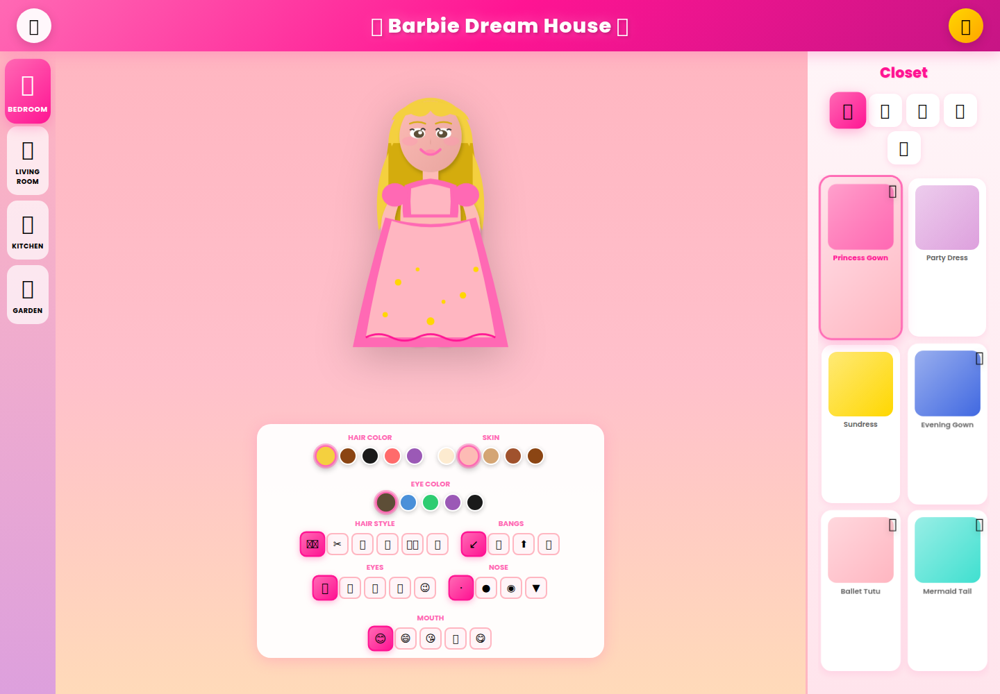

# Barbie Dream House

Step inside Barbie's Dream House and create a look that's all your own. Explore the rooms, try on outfits, and customize Barbie from head to toe.



## How to play

- Select **Let's Play!** to enter the Dream House.
- Visit the **Bedroom**, **Living Room**, **Kitchen**, and **Garden** using the room buttons.
- Browse the closet for dresses, tops, bottoms, shoes, and accessories. Select an item to wear it, or select it again to take it off.
- Change Barbie's hair, skin, eyes, and expression with the controls below her. Use the top-right button to clear the outfit.

## Play locally

With Node.js and npm installed, run:

```sh
npm ci
npm run dev
```

Open the local URL shown in your terminal (usually <http://localhost:5173/>).
